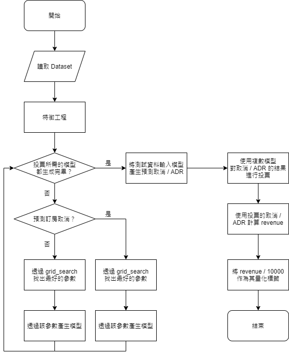
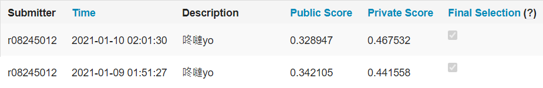
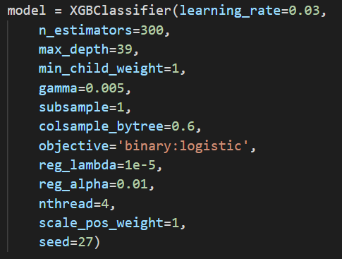
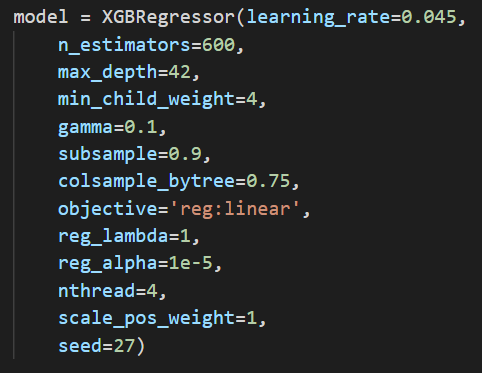
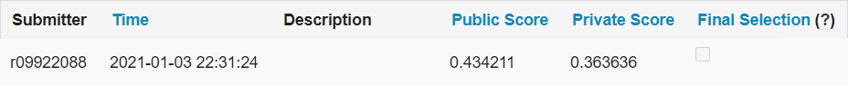
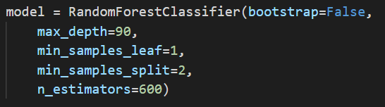
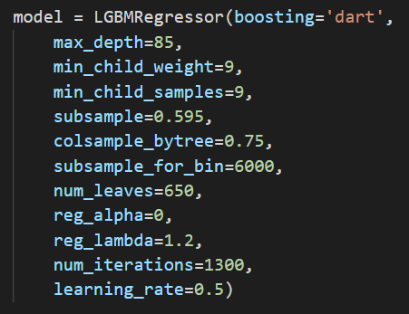
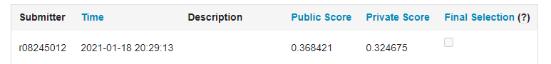

# Machine Learning - Final Project
### 目標
最終目標是**預測未來的飯店收入**，根據某個標準將當日收入量化為 $0-9$。
透過現有資料訓練兩個機器學習模型，根據未來訂單資料預測「訂單取消」與「$ADR$」。
我們以 $classification$ 預測訂單是否取消；以 $regression$ 預測 $ADR$。
結合兩者計算當日的 $revenue$，並將其值除以 $10000$ 作為**量化標籤**。

除此之外，透過特徵工程與 $blending$，我們降低 $err(y, \tilde{y})=|y-\tilde{y}|$ 以增進模型的準確度。
關於資料處理與模型選擇會在後面的篇幅說明。

### 流程圖
 

### 資料淨化$(Data\ Cleaning)$與特徵工程$(Feature\ Engineering)$
#### 資料淨化 $(Data\ Cleaning)$
原始資料含有缺失值、噪音、離群點，因此先進行**資料淨化**以確保資料格式正確。

> 壹、移除離群值、噪音

觀察各個欄位的資料分布，發現其中存在一些離群值、噪音。
我們移除數值不符合這些條件的資料：
- $adr<5300$；$adults<20$；$children<10$；$babies<9$

> 貳、移除缺失值

原始資料的「children」欄位具有部分的資料缺失，我們將這些資料全數移除。
至於其他欄位的缺失，會於特徵工程時一併移除。

#### 特徵工程 $(Feature\ Engineering)$
特徵工程可以讓原始資料轉變成**能夠更好地表達問題本質的特徵**，
對模型預測的結果具有舉足輕重的影響。

> 壹、移除不必要的欄位

不同的特徵對模型準確度的影響有所差異。
部分特徵與要解決的問題無關，有些則是不必要的資訊。
我們移除以下欄位，確保特徵與要解決的問題相關，同時加快模型的建構速度。

- 移除「ID」、「reservation_status_date」、「reservation_status」、「agent」、「company」
- 若預測訂單取消，則移除「adr」欄位；若預測 $ADR$，則移除「is_canceled」欄位

> 貳、進行 $One-Hot-Encoding$

為了解決屬性資料較難處理的問題，我們對以下欄位進行$One-Hot-Encoding$。
- 「hotel」、「meal」、「market_segment」、「distribution_cannel」、「deposit_type」、「customer_type」、「arrival_date_year」、「assigned_room_type」、「reserved_room_type」
- 「arrival_date_month」欄位的十二個月份，各自對應一個二維座標 $(cos(月份*30°), sin(月份*30°))$，作為新的特徵加入 $One-Hot-Encoding$

### 套件選擇及其比較
我們從 $scikit-learn$ (以下簡稱 $sklearn$)、$XGBoost$、$LightGBM$、$CatBoost$ 選擇對應的 $Random\ Forest$ 與 $Linear\ Regression$，分別建立模型預測「訂單取消」及「$ADR$」。

【efficiency】
- $sklearn > CatBoost = LightGBM >> XGBoost$
- $sklearn$ 的模型訓練速度最有效率
- $XGBoost$ 的準確度很好，然而模型訓練的花費時間最多
- $LightGBM$ 與 $CatBoost$ 在速度和準確度都有不錯的表現

【scalability】
- $sklearn = CatBoost = XGBoost > LightGBM$
- $sklearn$ 不容易 $overfitting$
- $CatBoost$ 使用對稱樹，這種樹是平衡的，不容易 $overfitting$
- $XGBoost$ 的 $Decision\ Tree$ 是 $Level-wise$ 增長，其 $overfitting$ 風險較小
- $LightGBM$ 的 $Decision\ Tree$ 是 $Leaf-wise$ 增長，容易生長出比較深的 $Decision\ Tree$，導致 $overfitting$

【popularity】
- $sklearn = CatBoost = XGBoost = LightGBM$
- 這些套件皆為知名且廣為使用的 $package$

【interpretability】
- $sklearn = CatBoost = XGBoost = LightGBM$
- 皆是基於 $Decision\ Tree$ 的套件，都能找出較重要的特徵，具有良好的 $interpretability$
- $feature\_importances\_attribute$ 允許我們查看哪些特徵對模型預測的影響最大

#### 實驗環境
| Student ID | OS             | python | sklearn | XGBoost | LightGBM | CatBoost |
| ---------- | -------------- | ------ | ------- | ------- | -------- | -------- |
| r08245012  | Linux (CentOS) | 3.8.3  | 0.23.1  | 1.3.1   | 3.1.1    | -        |
| r09944061  | macOS Big Sur  | 3.8.3  | 0.23.1  | 1.3.2   | 3.1.1    | -        |
| r09922088  | Windows 10     | 3.8.7  | 0.24.0  | 1.4.0   | -        | 0.24.4   |

### 結果
#### 壹、競賽結束前的選取紀錄
> 競賽結束時選取的兩個紀錄，由於 $overfitting$ 導致 $private\ score$ 較差。

- 預測取消：
    - 使用 $XGBoost$ 的 $classifier$，透過 $grid\_search$ 找出最佳參數。
    - 
- 預測 $ADR$：
    - 使用 $XGBoost$ 的 $regression$，透過 $grid\_search$ 找出最佳參數。
    - 
<!--
- 使用的參數：
    - 預測取消：
    - XGBClassifier(learning_rate =0.03,n_estimators=300,max_depth=39, min_child_weight=1,gamma=0.005,subsample=1,colsample_bytree=0.6,objective= 'binary:logistic',reg_lambda = 1e-5,reg_alpha = 0.01,nthread=4,scale_pos_weight=1,seed=27)
    - 預測ADR：
        - XGBRegressor(learning_rate =0.045,n_estimators=600,max_depth=42,min_child_weight=4,gamma=0.1,subsample=0.9,colsample_bytree=0.75,objective= 'reg:linear',reg_lambda = 1reg_alpha = 1e-5,nthread=4,scale_pos_weight=1,seed=27)
    -->
#### 貳、競賽結束前的最佳結果
> 並非競賽的最終選擇，但具有最佳的 $private\ score$。

- 預測取消：
    - 使用 $sklearn$ 的 $Random\ Forest$，參數僅有 $max\_depth = 10$
    - 
- 預測 $ADR$：
    - 使用 $sklearn$ 的 $Linear\ Regression$，沒有特別設置參數。
    - 

#### 參、競賽結束後的優化成果
> 不再對記分板上顯示的 $score$ 微調參數，而是使用 $grid\_search$ 以及 $random\ search$ 確定參數後就固定不動，以 $blending$ 提升模型的準確度，避免之前對 $score$ 微調參數而導致的 $overfitting$ 。

- 預測取消：
    - 使用 $sklearn$ 的 $Random\ Forest$，透過 $grid\_search$ 在一堆參數中尋找最佳的一組。之後將 $seed$ 改為 $random\ seed$，再讓模型以不同的 $random\ seed$ 生成約 $30$ 份文件，最後取 $7$ 個$p\ value$低的組合。
    - 
- 預測 $ADR$：
    - 使用 $LightGBM$ 的 $Linear\ Regression$，透過 $random\ search$ ，在一堆參數中搜尋 $2000$ 次取其中最佳的一組。之後將 $seed$ 改為 $random\ seed$，得到五個預測值並平均。
    - 

#### 肆、結論
由於過於著重在降低 $public\ score$ 的 $error$，並且人為地對 $score$ 微調參數，導致我們的模型對 $public$ 的測試樣本 $overfitting$，而這個結果也顯現在 $private\ score$ 上。
由於 $sklearn$ 需要 $tune$ 的參數較少，可以直接對所有的輸入 $grid\_search$ 後進行 $k-fold\ cross\ validations$。$LightGBM$ 需要的參數較多，無法直接對所有輸入的 $hyperparameter$ 進行 $cross\ validation$，故改為用 $random\ search$ 做 $2000$ 次搜尋。
至於 $XGBoost$，我們認為若時間以及計算資源足夠的話，$XGB$ 應該能達到比 $lgbm$ 與 $sklearn$ 更好的效果，但模型訓練過於耗時而沒有重做。

#### 伍、最佳方法
關於我們提供的最佳方法，首先以本報告提供的特徵工程做資料前處理，再使用 $sklearn(random\  forest)/Lightgbm/Catboost$ 等套件，對訂單的取消以及 $ADR$ 做預測，會比 $XGBoost$ 較有效率。
接著以 $grid\ search$ 和 $random\ search$ 尋找參數，當找到優化的參數就不用再一直微調，可以用不同的 $random\ seed$ 重複跑幾次，將預測的結果投票或平均，投票預測取消的部分可以選擇相關係數低的值來投票，糾正錯誤的效果會較好。

#### 陸、其他未採用的方法
除了上述提到的模型之外，我們也嘗試了很多方法，最後因準確度較差而未採用。
- 一、特徵工程：由相關係數決定哪些特徵較重要，移除相關係數低的特徵，效果並不顯著
- 二、使用神經網路以及 $RandomForestRegressor$ 做 $ADR$ 預測，效果不佳
- 三、使用神經網路來預測取消，效果不佳 ── 最高準確度只有$88\%$，可能的原因是沒有使用 $ensemble$ 的方式來學習，只靠單個神經網路無法將準確度提高；單顆決策樹的準確度和神經網路差不多，理由同前項，由此可見 $ensemble\ learning$ 的重要性
- 四、使用 $CatBoost$ 的模型預測取消和 $ADR$，效果不錯但略遜於 $blending$

### 分工
> r08245012
資料前處理以及特徵工程，架好可以調整參數的 $grid\_search$ 以及 $random\ search$。
實驗：截止前的 $sklearn$、$xgboost$、$lighgbm$ 調參；截止後嘗試 $sklearn$ 以及 $lightgbm$ 做 $blending$。
截止前做出最低「public score」；截止後做出最低「public score」與「private score」。

>r09922088
將「取消」與「$ADR$」的預測結果轉為 $revenue$ 並量化標籤。
實驗：截止前 $sklearn$、$xgboost$、$catboost$ 調參；截止後 $sklearn$、$catboost$ 調參。
截止前做出最低「private score」。

>r09944061
實驗：截止前 $xgboost$、$lightgbm$ 調參；截止後 $sklearn$、$xgboost$ 的 $adr$ 調參。

### 引文

Chen, T. and Guestrin, C. XGBoost: A scalable tree boosting system. In *Proceedings of the 22nd ACM SIGKDD International Conference on Knowledge Discovery and Data Mining*,
pp. 785–794. ACM, 2016.

Ke, G., Meng, Q., Finley, T., Wang, T., Chen, W., Ma, W., Ye, Q., and Liu, T.-Y. LightGBM: A highly efficient gradient boosting decision tree. In *Neural Information Processing Systems*,
pp. 3146–3154, 2017.

Dorogush, A. V., Ershov, V., and Gulin, A. Catboost: gradient boosting with categorical features support.
*arXiv preprint arXiv:1810.11363, 2018*
